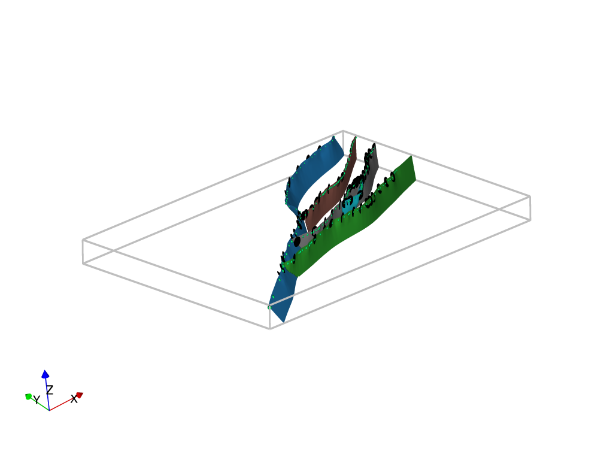

# Withers_2021_MFS
A model showing the 3D geometry of the Marlborough Fault System in New Zealand. The model is supplementary data for Megan Withers PhD thesis.

You can either clone the repository and run the model locally using jupyter notebooks or you can use google colab .
